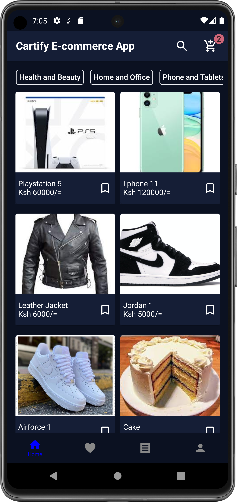

# Cartify E-commerce App

This is a simple Offline first E-commerce App written in Kotlin with Jetpack Compose

## Offline First Strategy
The offline first strategy used was to first load the products from the remote data source(Retrofit)
to the Local data source (Room) in the background using work manager. Everything shown in the app
is loaded from the room database (except search)

## Libraries and Tech stack

Libraries used include 
1. Retrofit
2. Dagger Hilt
3. Room Database
4. Datastore
5. Work Manager
6. Coil Compose
7. Accompanist
8. Kotlin coroutine & Flows 

## Screenshots of the App

  
